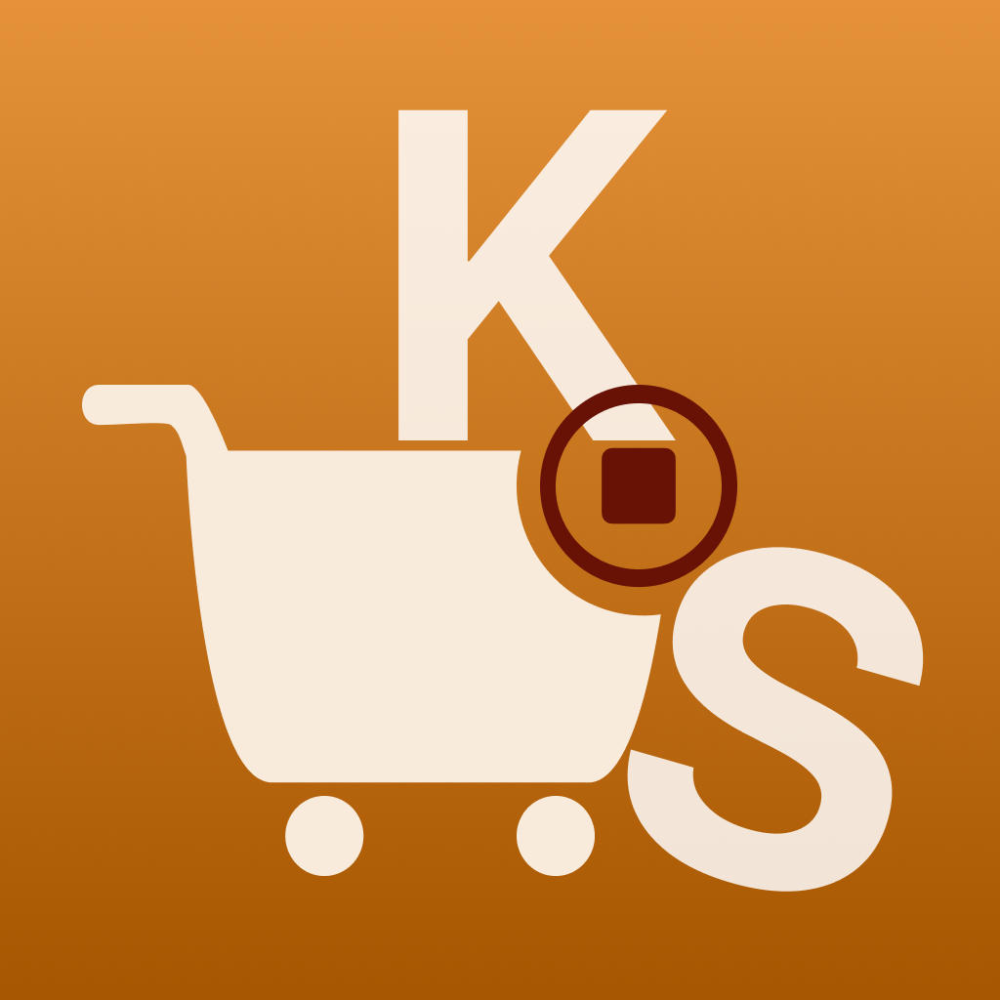

  

# KartStopper

   
**KartStopper** is a one-stop solution for shoppers looking to improve their spending habits.

## Features

- **Intuitive lists**: Create lists with price and notes. Mark as complete to track expenses. 
- **Dashboard**: Track how much you spend out of your allocated budget for each month.
- **Insights**: Visualize spend history by week, month and year. Check top expense categories.
- **Difficulty Mode**: Set your comfort level for expenditure tracking.

## Contributing

Please report any bugs/suggestions through email at [kartstopper@outlook.com](mailto:kartstopper@outlook.com) .

You may support this project financially-

